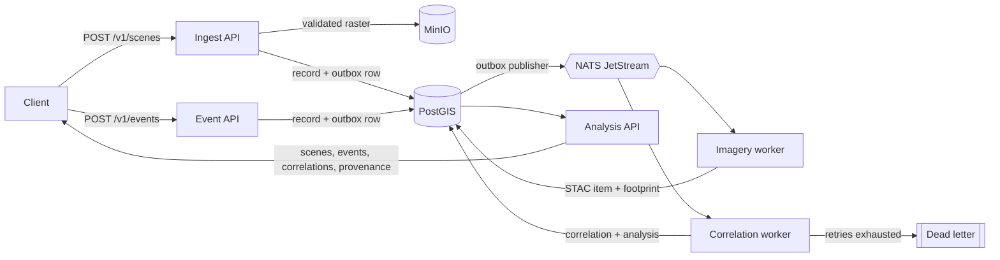

# Earth Observation Verification Lab

> This is an independently developed personal project using only synthetic and publicly available information. It does not reproduce an employer, customer, government, military, or production architecture.

A distributed Earth-observation pipeline built to answer one question honestly: **how do
you prove a system works, rather than assert it?**

TerraWatch is a fictional civilian environmental-response platform. It ingests synthetic
satellite scenes, correlates them against synthetic field sensor telemetry, and produces
analysis results. The interesting part is not the pipeline. It is everything wrapped
around it: formal requirements traced to executable checks, controlled fault injection
with observed recovery, and a verification report that fails when a check did not
actually run.

## The problem this is about

Most test suites tell you that the tests passed. They do not tell you which requirements
were verified, whether the report reflects what actually executed, or what happens when
the database disappears mid-transaction. Verification evidence is usually assembled by
hand at the end, which is exactly when it is least trustworthy.

This lab treats evidence as a build artifact. Forty versioned requirements map to named
executable checks. A requirement whose test did not run is recorded as `not observed`, and
`not observed` fails. Every rendered format is read back and reconciled against the raw
runner output, and a digest manifest makes an edited report detectable.

## Architecture



Writes use a transactional outbox, so a committed record and a published message cannot
disagree. Workers acknowledge explicitly, retry with bounded exponential backoff and
jitter, and write a visible dead letter when retries are exhausted. Spatial correlation
uses `ST_Covers`, so an event on a scene boundary matches deterministically.

Full detail is in [docs/ARCHITECTURE.md](docs/ARCHITECTURE.md), and the reasoning behind
each choice is in [docs/DECISIONS.md](docs/DECISIONS.md).

## What it demonstrates

| Area | What is actually implemented |
|---|---|
| Requirements engineering | 40 versioned requirements, a verification matrix, and five schema-validated formal procedures |
| Geospatial processing | GeoTIFF validation, digest-addressed storage, STAC catalog items, PostGIS footprints |
| Distributed delivery | Transactional outbox, explicit acknowledgement, bounded retry, visible dead letters, idempotent replay |
| Fault injection | Seven controlled faults with identity-guarded injection and recovery, plus redacted diagnostics |
| Interface contract | An executable Postman collection asserting status codes, the shared error envelope, and request identifiers |
| Performance gating | k6 with thresholds versioned in one file and re-checked in Python rather than trusted from an exit code |
| Security | Credential-shape scanning, public-boundary enforcement, container posture checks, two narrow documented exceptions |
| Evidence | One typed model rendered into JSON, Markdown, CSV, and JUnit, then read back and reconciled against a digest manifest |
| CI parity | Jenkins, GitHub Actions, and GitLab running one shared gate sequence, with structural tests proving they cannot drift |

## Quick start

Requirements: Python 3.12 and a running Docker engine. No credentials are needed. The
bootstrap step generates its own local secrets into an ignored file.

```bash
./scripts/bootstrap.sh
./scripts/terra.sh doctor
./scripts/terra.sh up
./scripts/terra.sh status
```

Everything runs through one entrypoint. Nothing expects you to call `docker` or `pytest`
directly.

```bash
./scripts/terra.sh test unit
./scripts/terra.sh procedure run TP-SYS-001
./scripts/terra.sh evidence
./scripts/terra.sh down
```

The four fastest levels need no environment at all, which makes them cheap to run on
every change:

```bash
./scripts/terra.sh test unit
./scripts/terra.sh test contract --mode static
./scripts/terra.sh test security
./scripts/terra.sh test pipeline
```

## Fault injection

Controlled faults refuse to act without `--apply`, verify the Compose project and the
container identity before touching anything, and record their state so a stale fault
cannot be left behind silently.

```bash
./scripts/terra.sh fault list
./scripts/terra.sh fault inject postgres-unavailable --apply
./scripts/terra.sh fault clear --apply
```

The database recovery procedure stages three telemetry events behind a paused worker,
pauses PostgreSQL, observes readiness degrade and the consumer redeliver, restores the
database before retry exhaustion, and then asserts that all three events processed exactly
once with no duplicates and no dead letters.

## Safety posture

- Published ports bind to loopback only.
- Application containers run unprivileged and read-only with `no-new-privileges`.
- Destructive commands verify the Compose project name and a project label on every
  container, and `./scripts/terra.sh clean-room` proves teardown leaves unrelated
  containers untouched.
- Local credentials are generated per checkout, ignored by Git, and redacted out of every
  diagnostic and evidence file before it is written.

## Documentation

- [Operator guide](docs/OPERATIONS.md)
- [Architecture](docs/ARCHITECTURE.md)
- [Design decisions](docs/DECISIONS.md)
- [Test plan](docs/TEST_PLAN.md)
- [Interface control document](docs/INTERFACE_CONTROL.md)
- [Troubleshooting](docs/TROUBLESHOOTING.md)

Documentation is checked rather than trusted. A test asserts that every command and
repository path named above exists and that every relative link resolves.

## Current state

The static gates and the ingestion, telemetry, and correlation workflows are verified.
The resilience drills, the Postman and k6 phases, and the clean-checkout run are
implemented but have not yet been executed end to end on a Docker host, so they are
reported as not observed rather than passing. `./scripts/terra.sh evidence` will say the
same thing about any requirement whose test did not run.

Ten of the forty requirements are observed on the published commit. The other thirty are
not observed, and none of them are passing. No check that has actually run is failing.

That distinction is the point of the project, so it is applied to the project itself. The
publish gate blocks on a check that ran and failed, and reports rather than blocks on one
that never ran; `docs/DECISIONS.md` records why.

## Scope and boundary

All names, coordinates, timestamps, and identifiers are synthetic and generated from a
fixed seed. See [PROJECT_BOUNDARY.md](PROJECT_BOUNDARY.md) for the content boundary,
[DATA_PROVENANCE.md](DATA_PROVENANCE.md) for how test inputs are produced, and
[SECURITY.md](SECURITY.md) for the scanner rules and their documented exceptions.

Licensed under the [MIT License](LICENSE).
